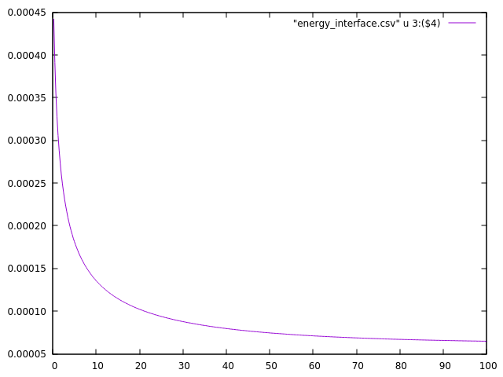
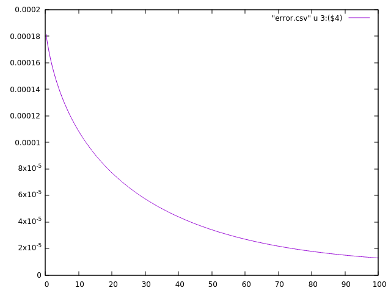
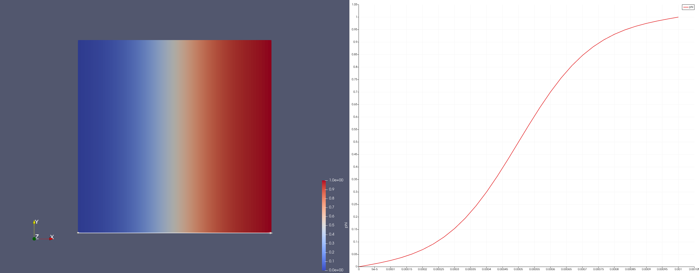

# 2D example :

## Overview

This example introduces a ....

## Problem statement 

## Source File Syntax

## How to run the test? 

Before running the test, the `main.cpp` source file must be compiled. 
To do it, the `main.cpp` source file must be added to the list of test to compile in the `$SRC_DIR/makefile` file
Afterwards, the following command must be run:
```Shell
make clean ; make -j N
```
where `N` is the number of CPU considered for compiling.

Once compilation is done, the `main` binary file is created and can be executed as follow:
Afterwards, the following command must be run:
```Shell
./main 
```

## How to visualize the results? 

At the end of the calculation, three CSV files are generated :
- energy_density.csv : time evolution of the total density energy
- energy_interface.csv : time evolution of the interfacial energy
- error.csv : L² norm of the error calculated between the exact solution and the calculated one.  

The following graphs are obtained by using the gnuplot command 

```plot 'filename.csv' u 3:4 w l```


| **Total Density Energy** |  **Interfacial Energy**   |
| :----------------------: | :-----------------------: |
|   |  |

|     **L² norm** |
:------:
| |


In addition, VTK outputs are generated in the Paraview folder. User is free to build its own outputs such as screenshots (see below for example) or animation (
[](animation.avi))


|   **Initial Condition**    |
| :------------------------: |
|  |


|   **Final solution**    |
| :---------------------: |
|  |


