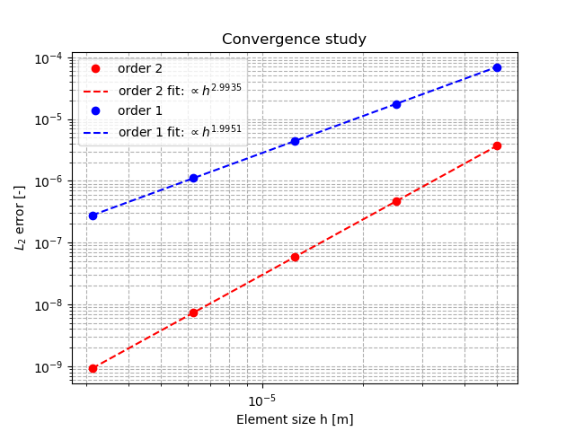

# 2D simulation 

This example code aims at checking the implementation of a pseudo-stabilization method that can be used by thermal diffusion problems given by:
$$
\frac{\partial c}{\partial t}=\nabla \cdot{} (M \nabla \mu)\text{ in }\Omega 
$$
where $\mu$ is a chemical potential. 

The method consists in adding a diffusive contribution in the RHS of the equation:
$$
\frac{\partial c}{\partial t}=\nabla \cdot{} (D \nabla c - D \nabla c) + \nabla \cdot{} (M \nabla \mu)\text{ in }\Omega 
$$
This contribution is obviously zero. However, its time discretization is given by:
$$
\nabla \cdot{} (M \nabla c^{n+1} - M \nabla c^{n})
$$ 
This test aims at checking that this contribution doesn't affect the solution driven by the chemical potential gradient. In other words, this test aims at doing a convergence analysis by showing that the solution of the following equation well converges towards the initial solution.

$$
\frac{\partial c}{\partial t}=\nabla \cdot{} (D \nabla c - D \nabla c) \text{ in }\Omega 
$$


## Statement of the problem

 
### __Governing equation__
Let us consider the following set of governing equations:
$$
\frac{\partial c}{\partial t}=\nabla \cdot{} (M \nabla c - M \nabla c)\text{ in }\Omega 
$$
The equation is solved in a 1D domain $\Omega=[0,1.e-3]$ (inline mesh).


### __Boundary conditions__

Neumann boundary conditions are prescribed on $\Gamma$:
$$
{\bf{n}} \cdot{} \lambda \nabla c=0 \text{ on }\Gamma
$$


### __Parameters__
For this test, the following parameters are considered:

| Parameter           | Symbol | Value   |
|---------------------|--------|---------|
| Primary coefficient | $M$    | $1.e-8$ |
| Domain size         | $L$    | $1.e-3$ |


### __Numerical scheme__

- Time marching: Euler Implicit scheme, $t\in[0,0.5]$, $\delta t=0.1$  
- Spatial discretization: uniform mesh built from MFEM with $20$, $40$, $80$, $160$, $320$ elements of order 1 and 2


 


## Running

### __Using the binary__
```shell
./Diffusion2Dtest1
```

### __Using ctest__

```shell
ctest -R Diffusion1Dtest3
```

### __In case of code coverage analysis__

```shell
make Diffusion1Dtest3_coverage
```

## Expected results



## References

None

## Intellectual Property

See [About page](../../../../../about.html) 